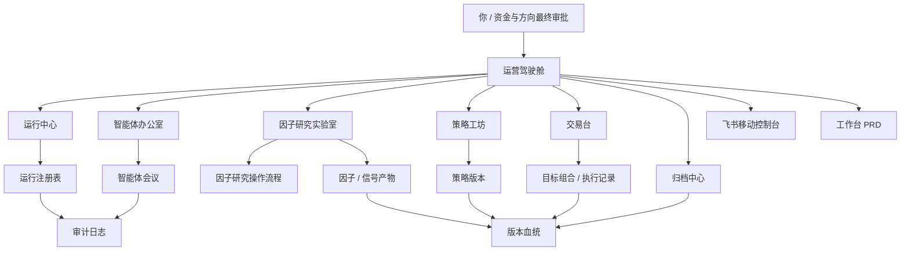

# AI 量化公司操作系统

本目录定义 Vortex 从“本地量化代码仓库”升级为“单人 + AI 智能体量化公司操作系统”的产品和架构蓝图。

它不替代 [[软件架构总览]]、[[产品原型总览]]、[[研究协作与产物治理]] 或 [[CogAlpha因子研究落地路线]]；它把这些材料提升到一个可运营的公司级界面：

```text
你
  -> 运营驾驶舱
  -> 控制面 / 运行注册表 / 审批 / 审计
  -> 岗位化智能体
  -> 结构化产物和版本血统
```

## 文档结构

| 文档 | 回答的问题 | 产物 |
|---|---|---|
| [[公司运营模型]] | 这个“AI 量化公司”有哪些岗位、权限、会议和审批？ | 组织模型与治理边界 |
| [[因子研究操作流程]] | 因子研究从议题到归档的真实生产线怎么运转？ | 研究流程和审查门禁 |
| [[工作台产品规格]] | 工作台界面应该看到什么、能做什么动作？ | 页面、对象、用户旅程 |
| [[运行与产物契约]] | 运行、任务、产物、决策、版本血统怎么成为事实源？ | 控制面契约和状态机 |
| [[Agent协作规格]] | 智能体如何开会、争论、产出结论并被审计？ | 智能体会议协议 |
| [[通知与手机触达]] | 系统什么时候应该推送飞书，移动端能做哪些轻量动作？ | 通知分级和移动端边界 |
| [[飞书移动控制台]] | 飞书应用如何成为通知和轻量交互入口？ | 移动端指令、卡片按钮、安全边界 |
| [[因子研究方法论]] | AI 因子研究到底怎么做，哪些判断交给脚本？ | 研究生产线方法论 |
| [[因子研究运行契约]] | 因子研究产物如何结构化，UI 和 agent 消费哪些字段？ | 候选、门禁、评测、晋升契约 |
| [[回测与CPCV评估协议]] | 候选策略如何区分训练级和测试级，何时能替代 baseline？ | CPCV、样本外和策略替代门槛 |
| [[UI原型验证流程]] | 产品和 UI 如何从文字规格变成可确认原型？ | 原型生成和走查流程 |
| [[工作台PRD]] | 第一版本地控制台如何分页面、管理设置、启动研究和策略？ | 可执行产品需求 |
| [[策略运行态工作台规划]] | 运行中的策略应该如何解释状态、持仓、异常、收益和人工门禁？ | 策略运行中心对象模型 |

## 当前可看原型

| 原型 | 文件 | 用途 |
|---|---|---|
| 因子研究工作台原型 | [factor_research_workbench.html](prototypes/factor_research_workbench.html) | 验证“运营驾驶舱 + 因子研究流程 + 智能体会议 + 飞书通知”的第一版信息架构 |
| 候选因子详情与质量门禁原型 | [factor_candidate_detail.html](prototypes/factor_candidate_detail.html) | 验证候选因子契约、质量门禁、智能体意见和飞书卡片是否足够具体 |

## 技能分类

AI 量化公司相关 skills 有两层位置：

| 分类 | 路径 | 用途 |
|---|---|---|
| 项目 skill 源文件 | `.codex/skills/` | Vortex 项目 skills 的唯一正文，进入仓库版本管理 |
| Codex 运行入口 | `~/.codex/skills/` | 当前 Codex 客户端实际加载目录；Vortex skill 项指向本仓库 `.codex/skills/` |
| GitHub 兼容入口 | `.github/skills` | 一个目录级软链接，指向 `../.codex/skills` |

第二版以 Codex 客户端为主，不维护两份 skill 内容。Vortex skill 的正文以仓库内 `.codex/skills/` 为源；`.github/skills` 只保留一个目录级软链接，`~/.codex/skills/<skill>` 指向仓库源目录，避免 Codex、GitHub 和仓库侧出现三套不同版本。

文档和 skill 的分工：

1. 文档回答“系统是什么、对象是什么、UI/产品要消费什么”。
2. Skill 回答“Codex 现在要怎么做、读什么、输出什么、何时停止”。
3. 如果内容是运行步骤、prompt、角色执行规则，优先放在 skill；如果内容是 schema、状态机、UI 字段或治理边界，放在文档。

## 系统关系



## 设计原则

1. **先定义流程，再设计界面**：因子研究、交易审查和通知机制要先清楚，UI 再承载这些流程。
2. **界面先回答运营问题**：实盘是否正常，研究是否有新结论，哪些任务阻塞，哪些动作需要你批。
3. **结构化事实先于聊天**：智能体可以解释和建议，但事实源必须是运行、产物、决策和审计。
4. **岗位化智能体先于“万能助手”**：每个智能体有职责、输入、输出和权限边界。
5. **飞书负责叫你回来**：系统持续运行；只有阻塞、审批、交易异常或重要研究结论才主动推送到独立飞书应用。
6. **研究自动化不等于实盘自动化**：研究可以主动探索；实盘必须经过明确门禁和人工确认。
7. **Codex 客户端优先**：第二版默认不依赖 OpenAI API key 或自研多 Agent 服务；用 Codex、skills、Markdown 状态卡和本地脚本推进研究。
8. **本地优先**：单机 Mac Mini + 工作区文件 + SQLite 控制面是第一版默认形态。

## 与现有系统的关系

- [[软件架构总览]] 已经定义数据、研究、策略、交易、通知的域边界。
- [[产品原型总览]] 已经定义快照、信号快照、目标组合、报告等用户对象。
- [[CogAlpha因子研究落地路线]] 已经给出 21 个研究视角、质量门禁、适应度评测和演化方法。
- 本目录补齐缺口：**系统如何持续运营、飞书如何提醒你、智能体如何像公司一样协作、UI 如何通过原型确认**。
