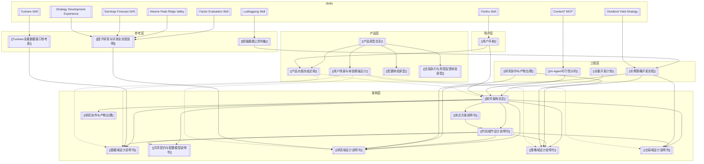

# Vortex Quant — 知识体系总览

> 这是 Vortex 量化研究平台的完整知识库入口。所有文档通过 `[[双向链接]]` 互联，可在 Obsidian 中打开 Graph View 查看全局知识图谱。

---

## 知识体系鸟瞰

---

## 一、产品原型 — 用户看到什么、做什么

> 产品原型定义用户视角下的产品形态，不绑定实现细节。冻结文档是 single source of truth。

| 文档 | 说明 | 状态 |
|------|------|------|
| [[产品原型总览]] | 产品原型写法原则、核心对象、角色、入口定义 | 活跃 |
| [[产品功能冻结文档]] | **全域动作规格 + 交付物 Schema + Profile 字段表（single source of truth）** | ✅ 已冻结 |
| [[用户场景与体验增强设计]] | 数据监控/因子评测/策略编排/回测生命周期/通知推送的完整体验 | 活跃 |
| [[配置体验原型]] | Profile / Preset / Pack 的用户体验与解释方式 | 活跃 |
| [[交易执行与风控反馈体验原型]] | 交易执行、风控反馈和对账体验 | 活跃 |

**v0.1 归档**（内容已合并到 [[用户场景与体验增强设计]]）：
- `01-数据服务体验原型` → 已合并 §一
- `03-因子研究体验原型` → 已合并 §二
- `04-策略开发与回测体验原型` → 已合并 §三§四

---

## 二、架构设计 — 系统如何划分、如何治理

> 架构设计负责将产品动作拆解为模块、接口和流程。[[软件架构总览]] 是架构层的总入口。

| 编号 | 文档 | 职责 |
|------|------|------|
| **00** | [[软件架构总览]] | 系统划分、治理原则、域间规则、跨域不变量 |
| **01** | [[数据域设计说明书]] | Data 域 API 契约、域内序列图、故障模式 |
| **02** | [[共享契约与配置模型说明书]] | Profile 四类配置 + 确定性/时间/ID/审计/错误 |
| **03** | [[研究域设计说明书]] | Research 域因子注册/评测/信号发布 |
| **04** | [[策略域设计说明书]] | Strategy 域回测/编译/信号消费 |
| **05** | [[交易域设计说明书]] | Trade 域执行/风控/对账 |
| **06** | [[代码细节设计说明书]] | DDL、函数签名、状态机、实现级时序图 |
| **07** | [[测试方案说明书]] | 分层测试、各域测试、确定性专项 |
| **08** | [[实例策略开发流程]] | 价值选股+动量择时端到端演示 |
| **09** | [[全量开发计划]] | 分阶段开发计划与 MVP 分期 |
| **10** | [[AI-Agent可行性分析]] | AI Agent 主动调用场景与可行性分析 |
| **12** | [[研究协作与产物治理]] | 研究探索、核心产品、artifact、策略晋升和仓库边界 |

**附录**：

| 文档 | 说明 |
|------|------|
| [[Tushare全量数据接口参考表]] | Tushare 全部数据接口参考 |
| [[因子研究与评测全流程说明]] | 因子研究的标准流程与评测方法 |
| [[超级鹿鼎公资料集]] | 鹿鼎公投资体系 PDF 的 Obsidian 索引与策略提炼 |

---

## 三、用户手册

[[用户手册]] — 面向用户的完整操作指南，覆盖环境准备 → 初始化 → 数据管理 → 通知与 AI Agent。

---

## 四、策略研究报告

| 报告 | 说明 |
|------|------|
| [[业绩预告漂移策略研究总结]] | v3 默认研究候选的完整说明书；详细记录策略规则、数据口径、防过拟合审查、可复用工程能力和上线门槛 |
| [[业绩预告漂移策略测试报告]] | 当前最强日频事件 alpha 候选；记录有效路径、无效路径、满仓口径和稳健性测试；同目录包含可复用的 `.json` 标准报告 |
| [业绩预告漂移策略可交易约束回测报告.html](策略研究/2026-04-28-业绩预告漂移策略可交易约束回测报告.html) | 可直接打开的 HTML 可视化报告；包含权益曲线、回撤、年度/月度收益、可交易性复核、持仓诊断 |
| [业绩预告漂移策略 v2 可交易约束回测报告.html](策略研究/2026-04-28-业绩预告漂移策略v2可交易约束回测报告.html) | v2 快速市场门控报告；包含空仓原因诊断，严格可交易口径升级为 S 级 |
| [业绩预告漂移策略 v3 可交易约束回测报告.html](策略研究/2026-04-28-业绩预告漂移策略v3可交易约束回测报告.html) | v3 参数冻结市场门控报告；`5/20` 门控通过 walk-forward，当前默认研究候选 |
| [业绩预告漂移策略 v3 精确可交易复核报告.html](策略研究/2026-04-28-业绩预告漂移策略v3精确可交易复核报告.html) | 全历史 `stk_limit` / `suspend_d` 精确约束复核；默认版仍为 S 级，并包含 3% 单票上限安全版和 1 亿元容量指标 |
| [业绩预告漂移策略 shadow 跟踪样例.html](策略研究/2026-04-28-业绩预告漂移策略shadow跟踪-20260424.html) | 2026-04-24 影子跟踪目标持仓和调仓变化；用于上线前观察真实目标组合 |
| [业绩预告漂移策略 v3 启动月份研究.html](策略研究/2026-04-28-业绩预告漂移策略v3启动月份研究.html) | 每年不同月份启动后的胜率、收益和回撤；用于判断 5-7 月与半年报前窗口 |
| [业绩预告漂移策略 v3 持仓安全性分析.html](策略研究/2026-04-28-业绩预告漂移策略v3持仓安全性分析.html) | 按日/月展示持仓、仓位变化、市值、估值、行业、板块和 1 亿资金参与率 |
| [业绩预告漂移策略 v3 仓位与收益增强研究.html](策略研究/2026-04-28-业绩预告漂移策略v3仓位与收益增强研究.html) | 对比默认满仓均分、单票上限留现金、更集中持仓、低流动性和强预告过滤 |
| [业绩预告漂移策略 forecast_surprise 因子评测.json](策略研究/2026-04-28-业绩预告漂移策略forecast_surprise因子评测.json) | 单独评测业绩预告 surprise 的多周期 IC、多空和覆盖率，用于判断强因子/弱模型属性 |
| [业绩预告漂移策略 artifact 清单.json](策略研究/2026-04-28-业绩预告漂移策略artifact清单.json) | 大 CSV 持仓明细和截图已外置到 workspace，此清单记录路径与归档原因 |

---

## 五、AI Skills

Skills 是 AI 辅助编程的专业技能模块，每个 skill 对应一个特定领域或操作。

| Skill | 用途 | 关联文档 |
|-------|------|---------|
| **Tushare** | 自然语言 → Tushare 数据获取与分析 | [[Tushare全量数据接口参考表]] |
| **Factor Evaluation** | 新因子多周期能力评测 | [[因子研究与评测全流程说明]]、[[研究域设计说明书]] |
| **Factor Mining Research** | 从书籍、指数编制方案、论坛/公开样本中挖掘候选因子 | [[因子研究与评测全流程说明]]、[[研究协作与产物治理]] |
| **Goal Achievement Review** | 策略目标达成审查；未达标时生成下一轮研究动作 | [[实例策略开发流程]]、[[研究协作与产物治理]] |
| **Earnings Forecast Drift** | 业绩预告公告后漂移策略研究与满仓 alpha 评级 | [[业绩预告漂移策略测试报告]]、[[因子研究与评测全流程说明]] |
| **Strategy Development Experience** | 策略开发经验、防过拟合、可交易性、容量和报告归档方法论 | [[业绩预告漂移策略研究总结]]、[[因子研究与评测全流程说明]] |
| **Dividend Yield Strategy** | 高股息率投资策略实现 | [[实例策略开发流程]]、[[策略域设计说明书]] |
| **Ludinggong** | 鹿鼎公语录心法 + 价值选股、趋势选时、估值定仓、波动降本的量化研究框架 | [[超级鹿鼎公资料集]]、[[实例策略开发流程]]、[[策略域设计说明书]] |
| **Volume Peak Ridge Valley** | 高频成交量峰岭谷因子构建 | [[因子研究与评测全流程说明]] |
| **Feishu** | 飞书消息投递 | [[用户手册]] §7、[[AI-Agent可行性分析]] |
| **Context7 MCP** | 实时文档查询 | [[AI-Agent可行性分析]] |
| **Obsidian** | 知识库 vault 管理与维护 | [[Vortex 知识库|顶层 MOC]]、[[软件架构总览]]、[[产品原型总览]] |

---

## 六、工程约定

[[Vortex 中文说明与注释规范]] — 代码注释与文档写作的工程规范。

---

## 七、标签索引

| 标签 | 覆盖文档 |
|------|---------|
| `#vortex/moc` | 本页 |
| `#vortex/architecture` | 架构设计 00–12 + 附录 |
| `#vortex/product` | 产品原型全部文档 |
| `#vortex/frozen` | [[产品功能冻结文档]] |
| `#vortex/data-domain` | [[数据域设计说明书]]、[[Tushare全量数据接口参考表]] |
| `#vortex/research-domain` | [[研究域设计说明书]]、[[因子研究与评测全流程说明]] |
| `#vortex/strategy-domain` | [[策略域设计说明书]]、[[实例策略开发流程]] |
| `#vortex/trade-domain` | [[交易域设计说明书]] |
| `#vortex/skill` | 全部 13 个 Skills |
| `#vortex/user-manual` | [[用户手册]] |

---

## 快速入口

- 想了解产品全貌？→ [[产品原型总览]]
- 想看具体的动作规格？→ [[产品功能冻结文档]]
- 想了解系统架构？→ [[软件架构总览]]
- 想查看代码级设计？→ [[代码细节设计说明书]]
- 想了解开发进度？→ [[全量开发计划]]
- 想了解研究产物如何治理和晋升？→ [[研究协作与产物治理]]
- 想了解研究员和工程怎么协作、不让实验污染核心仓库？→ [[研究协作与产物治理]]
- 想学习怎么用？→ [[用户手册]]
- 想做因子研究？→ [[研究域设计说明书]] + [[因子研究与评测全流程说明]]
- 想做策略开发？→ [[策略域设计说明书]] + [[实例策略开发流程]]
- 想看当前最强事件策略？→ [[业绩预告漂移策略测试报告]]
- 想用鹿鼎公语录指导量化研究？→ [[超级鹿鼎公资料集]]
