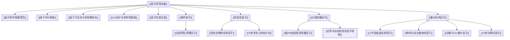

# 因子研究档案

> 本目录是 Vortex 因子研究的 Obsidian 入口：记录研究过的好因子、坏因子、失败原因、可复用经验和下一轮实验队列。大 CSV/HTML/JSON 留在 workspace，本目录只沉淀经验型 Markdown。

关联：[[因子研究与评测全流程说明]]、[[研究协作与产物治理]]、[[因子研究档案规范]]、[[因子评价框架]]、[[因子方法论与多周期组合]]、[[101因子全库研究路线]]、[[因子实验总表]]、[[论文学习资料]]

---

## 结构图

---

## 快速入口

| 入口 | 用途 |
|---|---|
| [[因子研究档案规范]] | 建档标准、状态机、模板和仓库/workspace 边界 |
| [[因子评价框架]] | 单因子/过滤/择时/组合腿的评价矩阵，避免用裸跑回撤误判因子 |
| [[因子方法论与多周期组合]] | 因子角色、多周期接入、组合构造和策略验收标准 |
| [[101因子全库研究路线]] | Alpha101 风格公式的全库复现、评测、归档和组合接入路线 |
| [[因子实验总表]] | 所有已研究因子的状态索引 |
| [[事件因子]] | 公告、业绩、事件驱动类因子 |
| [[资金流因子]] | moneyflow、主力/散户、拥挤交易线索 |
| [[价值质量因子]] | PB、股息、现金流、ROE 稳定性等中低频因子 |
| [[量价技术因子]] | 低波、反转、动量、成交量结构等价量因子 |
| [[外部Alpha资料线索]] | JKP、Alpha101、Quantpedia、A 股开源多因子项目等外部研究队列 |
| [[论文学习资料]] | 外部论文资料包入口；CogAlpha 等论文先在这里学习，不直接进入因子实验总表 |

---

## 当前结论快照

| 因子 | 状态 | 一句话结论 |
|---|---|---|
| [[业绩预告漂移因子]] | `candidate` | 当前最接近实盘影子跟踪的事件 alpha，但仍需修正实盘口径和影子跟踪验证 |
| [[资金流拥挤反转因子]] | `research_lead` | 反向资金流拥挤有较好 IC，但 long-only 回测为负，更像排序/对冲线索 |
| [[大单净流入原始方向]] | `rejected` | 原始“大单/超大单净流入=利好”在近三年方向为负 |
| [[小市值低波反转因子]] | `research_lead` | IC 很强，但单独 long-only 回撤过大 |
| [[低PB低波股息质量因子]] | `research_lead` | 稳健但收益不足，适合作为防守/组合因子线索 |
| [[峰岭谷成交量结构因子]] | `research_lead` | ridge 强正 IC 未复现，但 valley/peak 和 ridge 状态在组合/择时中仍有研究价值 |
| [[九转与筹码因子]] | `research_lead` | 筹码成本分布宽度有稳定 20 日排序力，九转事件暂作状态标签 |
| [[红利与自由现金流因子线索]] | `research_lead` | 复合质量成长价值 IC 强，但单独多头回撤过大，更适合作为组合质量腿 |
| [[动量与101量价因子]] | `research_lead` | 低波、拥挤反转和 101 风格公式有排序价值，但直接 TopN 多头失效 |
| [[外部Alpha资料线索]] | `research_lead` | JKP/Alpha101/Quantpedia 更适合作为因子地图和公式语法来源，不能直接复制成策略 |

---

## 标签索引

| 标签 | 含义 |
|---|---|
| `#vortex/factor-archive` | 因子研究档案 |
| `#vortex/research-domain` | 研究域 |
| `#vortex/moc` | Obsidian 索引页 |
