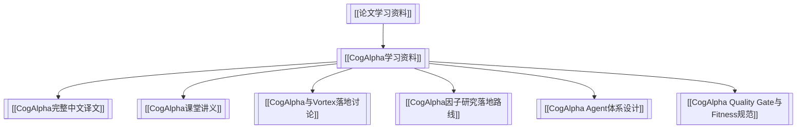

# 论文学习资料

> 本目录只保留已经和 Vortex 因子研究、agent 设计、quality gate、fitness 或工作流落地强绑定的论文资料。新的纯外部阅读、书籍和文章输入，优先进入 [vortex_docs](../../../vortex_docs)；进入 Vortex 本地数据、runner 或 artifact 后，再回到本仓库沉淀结论。

关联：[[Vortex 知识库]]、[[因子研究档案]]、[[因子研究与评测全流程说明]]

---

## 结构图

---

## 论文资料包

| 资料包 | 说明 |
|---|---|
| [[CogAlpha学习资料]] | Cognitive Alpha Mining via LLM-Driven Code-Based Evolution 的 PDF、完整中文译文、课堂讲义、agent 体系、quality/fitness 规范和 Vortex 落地路线 |

---

## 归档原则

1. 新的纯外部论文、书籍、研报和文章，先进入 `vortex_docs`；本目录不再作为通用外部阅读收件箱。
2. 只有当论文已经转成 Vortex 研究工作流、agent 规范、因子候选、quality gate 或实现路线时，才保留在本目录。
3. 论文结论必须经过 Vortex 的 PIT、成本、容量、可交易性和样本外验证后，才能进入 [[因子研究档案]] 或策略候选。
4. 课堂讲义可以有研究员观点，但完整译文应尽量忠实于论文原意。
5. 对外部论文的回测数字一律标注为“论文报告/论文声称”，不直接等同于 Vortex 结论。
6. 归属不清时按 [[研究协作与产物治理]] 判断：外部输入在 `vortex_docs`，代码绑定研究在本仓库。
