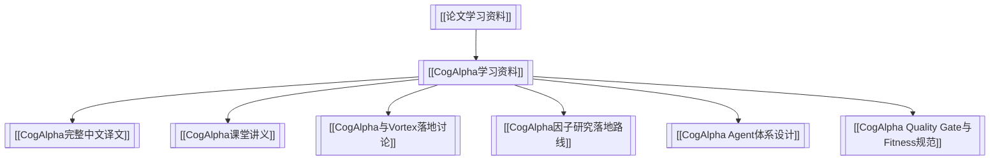

# 论文学习资料

> 本目录用于沉淀外部论文、研究报告和资料包的中文学习记录。这里记录“我们如何理解一篇论文”，不是因子实验结果，也不是策略上线依据。

关联：[[Vortex 知识库]]、[[因子研究档案]]、[[因子研究与评测全流程说明]]

---

## 结构图

---

## 论文资料包

| 资料包 | 说明 |
|---|---|
| [[CogAlpha学习资料]] | Cognitive Alpha Mining via LLM-Driven Code-Based Evolution 的 PDF、完整中文译文、课堂讲义、agent 体系、quality/fitness 规范和 Vortex 落地路线 |

---

## 归档原则

1. 论文资料先进入本目录，避免误放到因子实验总表。
2. 论文结论必须经过 Vortex 的 PIT、成本、容量、可交易性和样本外验证后，才能进入因子或策略候选。
3. 课堂讲义可以有研究员观点，但完整译文应尽量忠实于论文原意。
4. 对外部论文的回测数字一律标注为“论文报告/论文声称”，不直接等同于 Vortex 结论。
